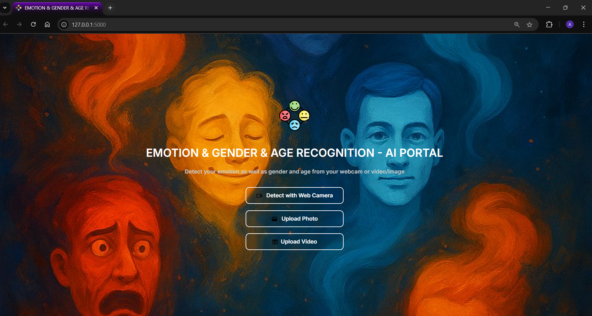
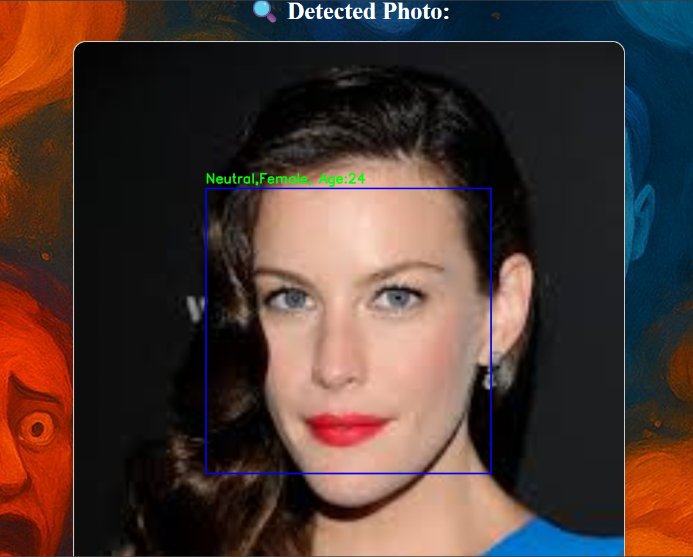
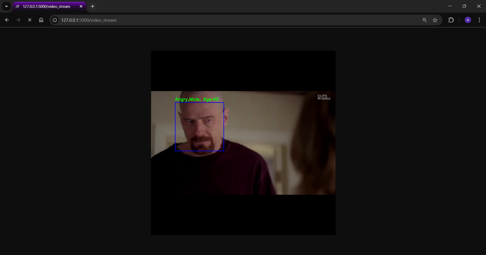
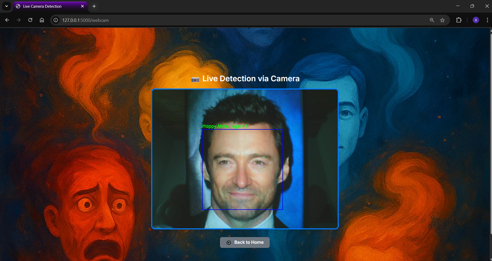

# 👤 Real-Time Emotion, Age, and Gender Recognition with CNNs

This project presents a Flask-based web application capable of recognizing **emotion**, **age**, and **gender** from human faces using **Convolutional Neural Networks (CNNs)**. It supports real-time webcam input, image upload, and video file analysis. The trained models are deployed via an intuitive web interface, making it practical for human-computer interaction scenarios.

## 🧠 Project Overview

- Predict **emotion**, **age**, and **gender** from facial images.
- Real-time predictions using a lightweight, multi-task AI system.
- Custom CNNs designed for task-specific optimization.
- Flask web app interface for live interaction.

---

## 🎯 Objectives

- Train 3 individual CNN models:
  - **Emotion Recognition** (multi-class classification)
  - **Age Estimation** (regression)
  - **Gender Classification** (binary classification)
- Deploy the system using Flask for three input modes:
  - Webcam
  - Photo upload
  - Video upload

---

## 📚 Theoretical Framework

- **Convolutional Neural Networks (CNNs)** are used as the core architecture.
- Models are designed separately to better specialize on each task.
- Applied training strategies include:
  - EarlyStopping
  - ReduceLROnPlateau
  - Data Augmentation
  - Dropout & Regularization

---

## 🗃️ Datasets Used

### FER2013 (Emotion Recognition)
- Grayscale, 48×48 resolution
- 7 emotion classes: Angry, Disgust, Fear, Happy, Sad, Surprise, Neutral  
- Highly imbalanced dataset  

### UTKFace (Age & Gender)
- RGB images
- Age: [0–116] (Regression)
- Gender: Male (0), Female (1)

---

## ⚙️ Preprocessing Pipeline

- Facial region cropping (48x48 or 64x64)
- Pixel normalization (0–1)
- Data augmentation: rotation, flipping, zoom
- Result: diversified and enriched training samples

---
## 🧠 Models

Three separate CNN models were developed for:

| Task                | Dataset    | Evaluation Metric    | Performance            |
|---------------------|------------|-----------------------|------------------------|
| Emotion Detection   | FER2013    | Accuracy, F1-Score    | ~67.28% Accuracy       |
| Age Estimation      | UTKFace    | MAE, MSE, R² Score    | MAE: 5.98 / R²: 0.82   |
| Gender Classification | UTKFace  | Accuracy, F1-Score    | ~88.9% Accuracy        |

🧩 **Download Trained Models** from Kaggle:

- Emotion: [FER2013 Emotion CNN](https://www.kaggle.com/datasets/msambare/fer2013)
- Age & Gender: [UTKFace Dataset](https://susanqq.github.io/UTKFace/)

## 🧱 Model Architectures

Each model uses a custom CNN with the following characteristics:

| Task | Activation | Output | Notes |
|------|------------|--------|-------|
| Emotion | ELU | 7 Softmax | Best for emotion classification |
| Age | ReLU | 1 Linear | Regression output |
| Gender | ReLU | 1 Sigmoid | Binary classification |

---

## 📊 Evaluation Results

### Emotion Recognition
- Test Accuracy: **67.28%**
- F1-score (Happy): **0.88**
- F1-score (Surprise): **0.77**

### Age Estimation
- MAE: **5.98**
- MSE: **72.34**
- R² Score: **0.82**

### Gender Classification
- Accuracy: **88.90%**
- F1-score Female: **0.90**
- F1-score Male: **0.89**

---

## 💻 System Integration (Flask)

All three models are integrated into a single web interface using Flask. The interface supports:

- 📸 **Photo Upload**: Select image and get prediction
- 📹 **Video Upload**: Frame-by-frame analysis
- 🎥 **Webcam Detection**: Real-time face analysis

### 🖼 Output Example:
Prediction:

Emotion: Happy,

Gender: Female,

Age: 24

---

## 📈 System Strengths & Limitations

### ✅ Strengths
- Multi-input flexibility: webcam, image, and video
- Real-time prediction performance
- High accuracy in gender classification
- Clean and user-friendly web interface

### ⚠️ Limitations
- Lower age estimation accuracy for extreme ages
- Emotion detection affected by lighting, occlusion
- No backend data logging feature yet

---

## 🏁 Conclusion

- A fully functional real-time facial analysis system was developed.
- Custom CNNs were trained for each task using public datasets.
- The final system shows high gender prediction performance and fair emotion/age prediction accuracy.
- Ready for use in human-computer interaction, education, healthcare, and more.

---

## 📸 System Interface Preview

### 🏠 Homepage

### 📷 Photo Upload Detection

### 📹 Video Frame Analysis

### 🎥 Real-Time Webcam Detection

(*Note: Direct model links or download instructions can be added in `models/README.md`*)

